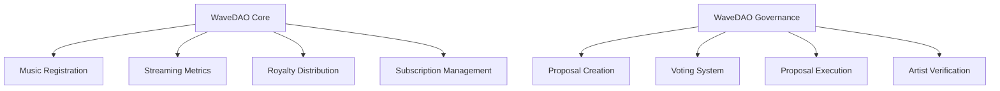

# WaveDAO Music Network

A decentralized autonomous organization revolutionizing music publishing, streaming, and monetization on the blockchain. WaveDAO creates direct connections between artists and listeners while ensuring fair compensation through automated royalty distribution.

## Overview

WaveDAO enables artists to:
- Tokenize their music as digital assets
- Receive automatic royalty payments based on streaming metrics
- Participate in platform governance with enhanced voting power

Listeners can:
- Subscribe to access exclusive content
- Support artists directly through streaming
- Participate in governance decisions

## Architecture

The platform consists of two main smart contracts:



### Core Components
- **Music Registration**: Handles track ownership and metadata
- **Streaming**: Tracks listener activity and metrics
- **Royalties**: Manages automated distribution of subscription revenue
- **Governance**: Enables community decision-making on platform features

## Contract Documentation

### WaveDAO Core (`wavedao-core.clar`)

The central hub for music platform operations.

#### Key Functions
- `register-track`: Register new music tracks with royalty splits
- `record-stream`: Log streaming activity for royalty calculations
- `subscribe`: Purchase platform subscription
- `distribute-period-royalties`: Process royalty payments to artists

#### Access Control
- Track management limited to track owners
- Administrative functions restricted to contract owner
- Streaming requires active subscription

### WaveDAO Governance (`wavedao-governance.clar`)

Handles platform governance and decision-making.

#### Key Functions
- `create-proposal`: Submit new governance proposals
- `vote`: Cast votes on active proposals
- `execute-proposal`: Implement passed proposals
- `register-artist`: Verify artists for enhanced voting power

#### Access Control
- Proposal creation requires token ownership
- Voting weight based on token holdings
- Artist verification restricted to admin
- Proposal execution based on voting thresholds

## Getting Started

### Prerequisites
- Clarinet
- Stacks wallet
- WaveDAO tokens for governance participation

### Installation

1. Clone the repository
```bash
git clone https://github.com/yourusername/wavedao.git
```

2. Install dependencies
```bash
clarinet install
```

### Basic Usage

1. Register as an artist:
```clarity
(contract-call? .wavedao-core register-track "Song Title" "metadata-url" royalty-splits)
```

2. Subscribe to the platform:
```clarity
(contract-call? .wavedao-core subscribe)
```

3. Create a governance proposal:
```clarity
(contract-call? .wavedao-governance create-proposal "Title" "Description" proposal-type)
```

## Function Reference

### Core Contract

```clarity
(register-track (title (string-ascii 100)) 
                (metadata-url (string-ascii 255))
                (royalty-splits (list 10 {recipient: principal, share-percentage: uint})))
```
- Registers a new music track with specified royalty distribution

```clarity
(subscribe)
```
- Purchases platform subscription for streaming access

### Governance Contract

```clarity
(create-proposal (title (string-ascii 100))
                 (description (string-utf8 1000))
                 (proposal-type uint))
```
- Creates new governance proposal

```clarity
(vote (proposal-id uint) (vote-option uint))
```
- Casts vote on active proposal

## Development

### Testing
Run the test suite:
```bash
clarinet test
```

### Local Development
1. Start local Clarinet console:
```bash
clarinet console
```

2. Deploy contracts:
```bash
clarinet deploy
```

## Security Considerations

### Known Limitations
- Royalty calculations performed on-chain
- Fixed subscription duration
- Limited proposal execution mechanisms

### Best Practices
- Verify royalty split percentages total 100%
- Maintain minimum token balance for governance participation
- Monitor subscription status before streaming
- Review proposal parameters before voting